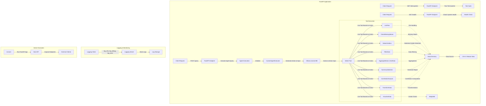

# Project Architecture

The following Mermaid diagram illustrates the project's architecture:

```mermaid
graph TD;
  subgraph "FastAPI Application"
    A1[Client Request] -->|POST /query| B1[FastAPI Endpoint]
    A2[Client Request] -->|GET /test-queries| B2[FastAPI Endpoint]
    A3[Client Request] -->|GET /health| B3[FastAPI Endpoint]
    
    B1 -->|Execute Agent Query| C[Agent Execution]
    B2 -->|Run Test Queries| D[Test Suite]
    B3 -->|Check System Health| E[Health Check]

    C -->|Initialize| F[CustomAgentExecutor]
    F -->|Generate Action & Input| H[Ollama Llama3:8B]
    
    H -->|Action & Action Input| G[Select Tool]
    
    subgraph "Tool Execution"
      G -->|Use Tool Based on Action| G1[ListFiles]
      G -->|Use Tool Based on Action| G2[CheckMissingValues]
      G -->|Use Tool Based on Action| G3[DetectOutliers]
      G -->|Use Tool Based on Action| G4[FilterData]
      G -->|Use Tool Based on Action| G5[AggregateData & SortData]
      G -->|Use Tool Based on Action| G6[SummaryStatistics]
      G -->|Use Tool Based on Action| G7[VisualizeData]
      G -->|Use Tool Based on Action| G8[CorrelationAnalysis]
      G -->|Use Tool Based on Action| G9[TransformData]
    end

    G1 -.->|File Handling| J[Data Directory]
    G2 -.->|Missing Values| J
    G3 -.->|Statistical Outlier Detection| J
    G4 -.->|Data Filtering| J
    G5 -.->|Aggregations| J
    G6 -.->|Generate Report| J
    G7 -.->|Create Charts| K[Matplotlib]
    G8 -.->|Correlation Computation| J
    G9 -.->|Transformations| J

    J -->|Data Source| L[CSV & Tabular Data]
    
  end

  subgraph "Logging & Monitoring"
    M[Logging Client] -->|log_info, log_debug, log_error| N[Logging Server]
    N -->|Store Logs| O[Log Storage]
  end

  subgraph "Server Execution"
    P[Uvicorn] -->|Run FastAPI App| Q[Host API]
    Q -->|Expose Endpoints| R[External Clients]
  end


```

---
